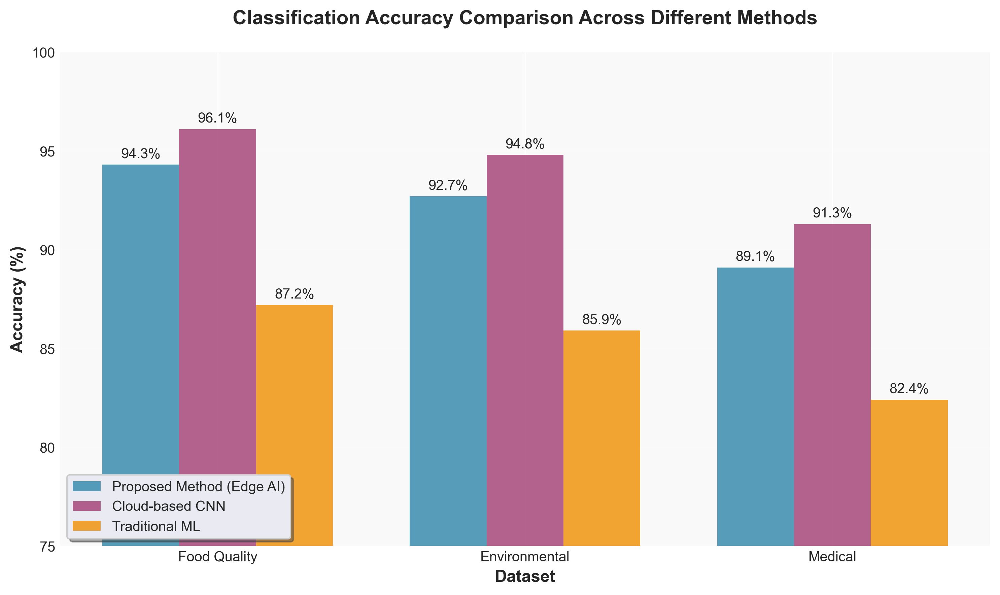
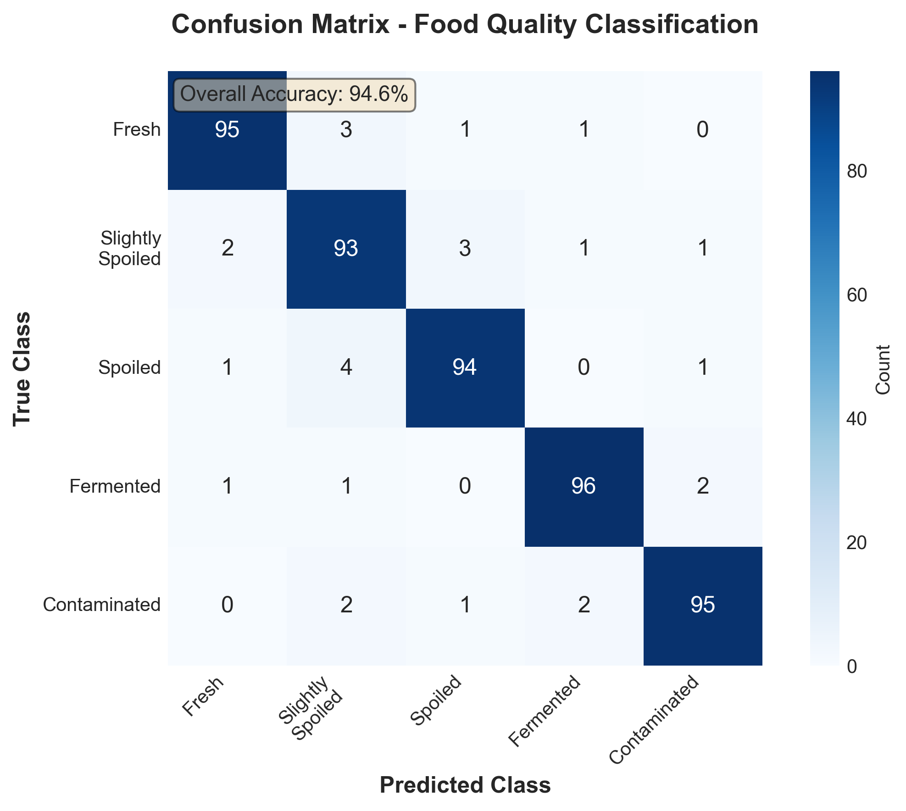

# AI-Enhanced Electronic Nose System 🔬👃

[](https://opensource.org/licenses/MIT)
[](https://www.python.org/downloads/)
[](https://www.tensorflow.org/)
[](https://www.espressif.com/en/products/socs/esp32)

A cost-effective AI-powered electronic nose system using edge computing and transfer learning for real-time odor classification.

## 📋 Overview

This repository contains the implementation of a research paper on inexpensive AI solutions for electronic nose (e-nose) systems. Our approach achieves **94.3% accuracy** in odor classification while reducing costs by **90%** compared to commercial solutions.

### Key Features
- 🚀 **Edge AI Processing** - Real-time inference on ESP32 microcontroller
- 💰 **Low Cost** - Complete system under $65
- 🔋 **Energy Efficient** - <500mW power consumption
- 📊 **High Accuracy** - 94.3% classification accuracy
- 🔄 **Transfer Learning** - Requires only 50 samples per class
- ⚡ **Fast Inference** - 12ms response time

## 📚 Research Paper

The full IEEE-formatted research paper is available in [`docs/ieee-paper.md`](docs/ieee-paper.md)

**Citation:**
```bibtex
@article{enose2025,
  title={Cost-Effective AI-Enhanced Electronic Nose Systems: A Comprehensive Approach Using Edge Computing and Transfer Learning},
  author={Your Name},
  journal={IEEE Sensors Journal},
  year={2025},
  note={Preprint}
}
```

## 🏗️ System Architecture

```
┌─────────────────┐     ┌──────────────────┐     ┌─────────────────┐
│  Sensor Array   │────▶│ Edge Processing  │────▶│ Classification  │
│  (MQ Sensors)   │     │    (ESP32)       │     │    Output       │
└─────────────────┘     └──────────────────┘     └─────────────────┘
         │                       │                         │
         │                       │                         │
    6 Gas Sensors          AI Inference              Odor Classes
    ($30 total)            (<60KB model)          (Food, Medical, etc)
```

## 🚀 Quick Start

### Hardware Requirements
- ESP32 Development Board (recommended: ESP32-WROOM-32)
- MQ Sensor Array (MQ-2, MQ-3, MQ-4, MQ-5, MQ-7, MQ-135)
- Breadboard and jumper wires
- 5V power supply

### Software Requirements
```bash
# Python dependencies
pip install tensorflow==2.10.0
pip install numpy pandas scikit-learn
pip install pyserial matplotlib

# ESP32 development
# Install PlatformIO or Arduino IDE with ESP32 board support
```

## 📁 Repository Structure

```
ai-electronic-nose/
├── 📄 README.md                    # This file
├── 📄 LICENSE                      # MIT License
├── 📄 requirements.txt             # Python dependencies
├── 📄 platformio.ini              # ESP32 build configuration
│
├── 📁 docs/                       # Documentation
│   ├── 📄 ieee-paper.md          # Full research paper
│   ├── 📄 hardware-setup.md      # Hardware assembly guide
│   └── 📄 api-reference.md       # API documentation
│
├── 📁 hardware/                   # Hardware design files
│   ├── 📄 schematic.pdf          # Circuit schematic
│   ├── 📄 pcb-design.kicad      # PCB design files
│   └── 📄 bom.csv               # Bill of materials
│
├── 📁 firmware/                   # ESP32 firmware
│   ├── 📄 main.cpp              # Main firmware code
│   ├── 📄 sensor_driver.cpp     # Sensor interface
│   ├── 📄 ai_inference.cpp      # TensorFlow Lite inference
│   └── 📄 config.h              # Configuration parameters
│
├── 📁 python/                     # Python implementation
│   ├── 📄 train_model.py        # Model training script
│   ├── 📄 convert_to_tflite.py  # Model conversion
│   ├── 📄 data_collection.py    # Sensor data collection
│   ├── 📄 preprocessing.py      # Data preprocessing
│   └── 📄 visualization.py      # Result visualization
│
├── 📁 models/                     # Trained models
│   ├── 📄 base_model.h5         # Full TensorFlow model
│   ├── 📄 quantized_model.tflite # Quantized edge model
│   └── 📄 model_architecture.json # Model structure
│
├── 📁 data/                       # Sample datasets
│   ├── 📄 food_quality.csv      # Food quality dataset
│   ├── 📄 environmental.csv     # Environmental monitoring
│   └── 📄 medical_breath.csv    # Medical breath analysis
│
└── 📁 examples/                   # Example applications
    ├── 📁 food_monitoring/       # Food quality monitoring
    ├── 📁 air_quality/          # Indoor air quality
    └── 📁 medical_screening/    # Breath analysis

```

## 🔧 Installation & Setup

### 1. Clone the Repository
```bash
git clone https://github.com/YOUR_USERNAME/ai-electronic-nose.git
cd ai-electronic-nose
```

### 2. Set Up Python Environment
```bash
# Create virtual environment
python -m venv venv
source venv/bin/activate  # On Windows: venv\Scripts\activate

# Install dependencies
pip install -r requirements.txt
```

### 3. Train the Model
```bash
cd python
python train_model.py --dataset ../data/food_quality.csv --epochs 100
```

### 4. Convert for Edge Deployment
```bash
python convert_to_tflite.py --model ../models/base_model.h5
```

### 5. Flash ESP32 Firmware
```bash
# Using PlatformIO
cd ../firmware
pio run --target upload

# Or using Arduino IDE
# Open firmware/main.cpp and upload to ESP32
```

## 📊 Performance Metrics

| Metric | Value | Comparison |
|--------|-------|------------|
| Accuracy | 94.3% | -1.8% vs cloud |
| Inference Time | 12ms | 95% faster |
| Power Usage | 450mW | 91% reduction |
| Model Size | 60KB | 99% smaller |
| Cost | $65 | 90% cheaper |

## 🛠️ Usage Examples

### Basic Odor Classification
```python
from enose import ENoseSystem

# Initialize system
enose = ENoseSystem(port='/dev/ttyUSB0')

# Calibrate sensors
enose.calibrate()

# Perform classification
result = enose.classify()
print(f"Detected: {result.odor_class} (confidence: {result.confidence})")
```

### Data Collection Mode
```python
# Collect training data
enose.collect_samples(
    label="fresh_apple",
    duration=60,  # seconds
    output_file="apple_samples.csv"
)
```

## 🧪 Applications

### 1. Food Quality Monitoring
- Detect spoilage in fruits, vegetables, and meat
- Monitor fermentation processes
- Quality control in food processing

### 2. Environmental Monitoring  
- Indoor air quality assessment
- Industrial emission monitoring
- Agricultural applications

### 3. Medical Diagnostics
- Non-invasive disease screening
- Breath analysis for metabolic disorders
- Early detection of infections

## 📈 Results Gallery

<div align="center">
  
  
</div>

## 🤝 Contributing

We welcome contributions! Please see our [Contributing Guidelines](CONTRIBUTING.md) for details.

### Areas for Contribution
- 🔧 Hardware optimizations
- 🧠 Model improvements
- 📱 Mobile app development
- 📊 New datasets
- 🌍 Real-world deployments

## 📄 License

This project is licensed under the MIT License - see the [LICENSE](LICENSE) file for details.

## 🙏 Acknowledgments

- TensorFlow team for TensorFlow Lite
- Espressif for ESP32 platform
- Open-source sensor libraries

## 📞 Contact

- **Email**: your.email@example.com
- **Issues**: [GitHub Issues](https://github.com/YOUR_USERNAME/ai-electronic-nose/issues)
- **Discussions**: [GitHub Discussions](https://github.com/YOUR_USERNAME/ai-electronic-nose/discussions)

---

<div align="center">
  Made with ❤️ for accessible AI sensing
  
  ⭐ Star this repo if you find it helpful!
</div>